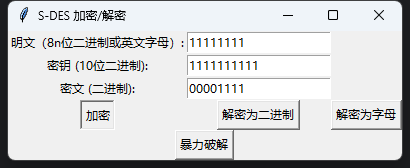
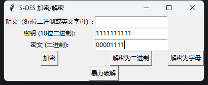
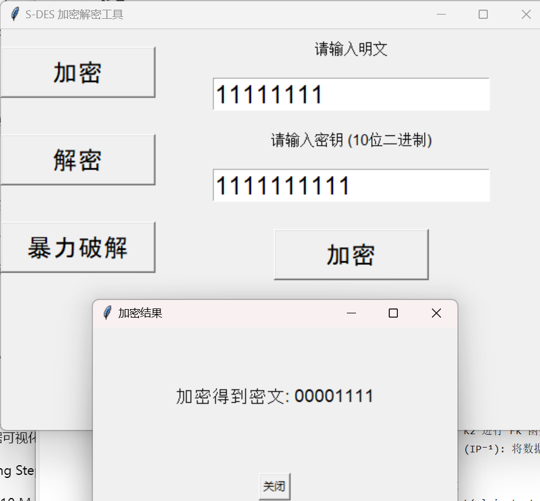
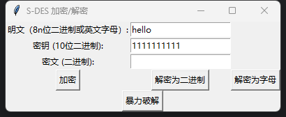
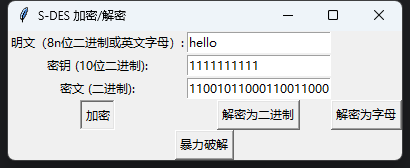
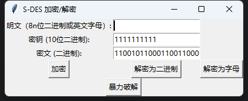
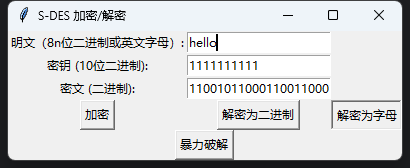
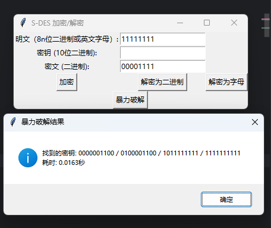
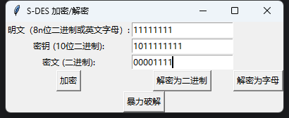

# S-DES 加密/解密工具测试结果

## 第一关：基本测试

在原定基础上，扩展了输入明文(或密文)的范围至8nbit(即8的倍数位），可以通过输入（明文 / 密钥）或（密文 / 密钥）的组合来进行加密或解密操作,如下图所示：

- 输入明文和密钥：
)
- 点击“加密”按钮：

- 输入密文和密钥：

- 点击“解密为二进制”按钮：

## 第二关：交叉测试

本组S-DES对（明文：11111111 / 密钥：1111111111）的组合进行加密的结果如上图所示（密文结果为：00001111）

友组S-DES对同一个明文密钥组合进行加密的结果如下图所示：

## 第三关：扩展功能

将输入输出扩展到ASCII字符串，用户可以在明文处输入字符并输入10位密钥进行加密运算，也可以输入二进制密文和密钥进行解密运算输出字符形式的明文结果

此处为方便用户的使用，提供了按钮以供用户选择将解密结果以何种方式（二进制 / 英文字母）输出：

- 在明文处输入字符串“hello”（示例）并输入10位密钥：

- 点击加密按钮：

- 输入二进制密文和密钥：

- 点击“解密为字母”：

## 第四关&第五关：暴力破解&封闭测试

用户可以通过输入（明文 / 密文）的组合来进行对10位密钥的破解：

- 输入明文和密文后点击“暴力破解”按钮：

由上图可知，对于随机选择的一个明密文对，确实存在不止一个密钥

同时可知，对于明文空间任意给定的明文分组，可以出现选择不同的密钥加密得到相同密文的情况

- 示例1（明文：11111111 / 密钥：1111111111）：

- 示例2（明文：11111111 / 密钥：1011111111）：

